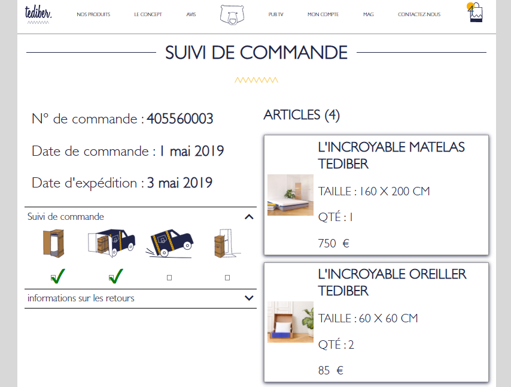
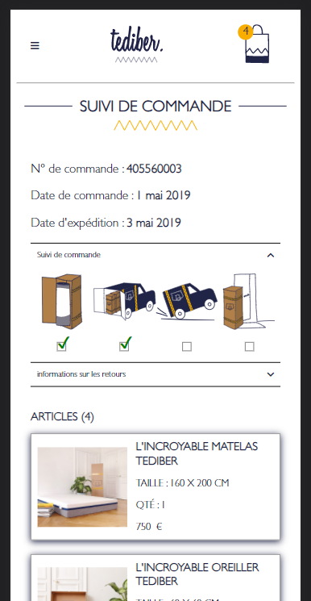

# 2nd project Vuesjs

📅 started in August 2021  
✅ finish

## To do that ?

Test for a stage at Tediber.





## Get the Code# tediber

https://github.com/frmi2018/tediber-test.git

```
npm install
```

### Compiles and hot-reloads for development

```
npm run serve
```

### Compiles and minifies for production

```
npm run build
```

### Lints and fixes files

```
npm run lint
```

### Customize configuration

See [Configuration Reference](https://cli.vuejs.org/config/).
